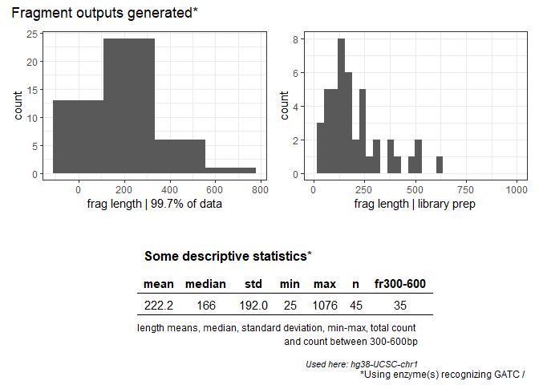

<!-- README.md is generated from README.Rmd. Please edit that file -->

# FROGmentator

<!-- badges: start -->
<!-- badges: end -->


The goal of FROGmentator is to calculate fragment lengths upon template
DNA fragmentation with specific pattern recognizing, (restriction)
enzymes

## Installation

You can install the development version of FROGmentator from
[GitHub](https://github.com/) with:

``` r
# install.packages("devtools")
devtools::install_github("pauliusbaltrusis/FROGmentator")
```

## Example

This is a basic example which shows you what FROGmentator does:

``` r
library(FROGmentator)
#
library(tidyverse)
library(ggplot2)
library(ggpubr)
# 
my_DNA<-gen_DNA(10000)
pattern1<-'GATC'
FROG_pal_output<-FROG_pal(my_DNA, pattern1)

head(FROG_pal_output) # fragment length sizes
#> [1] 153  23 105 456 183 438
```

``` r
FROG_plot(FROG_pal_output, pattern1)
```


